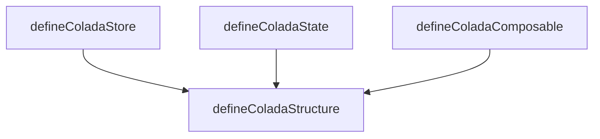

# colada

## Purpose

Package-level vision for colada-store. Single entry for how the pieces fit together. Details live in the linked requirement files; this file does not repeat them.

## Architecture

- **defineColadaStructure** – Consumes StructureAccessorsConfig; injects prior accessors into each factory context; dynamic internals and \_structureAccessorsConfig. See [define-colada-structure.agents.md](./define-colada-structure.agents.md).
  - **defineColadaStructureAccessorsConfigMap** – Builds ordered, typed Structure Accessors config (lookup by key and index). See [define-colada-structure-accessors-config-map.agents.md](./define-colada-structure-accessors-config-map.agents.md).
- **defineColadaStore** – Store interface (id, deps, constants, state, getters, helpers, actions, hooks). Singleton/global semantics are specific to the store. See [define-colada-store.agents.md](./define-colada-store.agents.md).
- **defineColadaState** – State interface (name, state, getters, helpers, actions, hooks). See [define-colada-state.agents.md](./define-colada-state.agents.md).
- **defineColadaComposable** – Composable interface with constructor/init-call props. See [define-colada-composable.agents.md](./define-colada-composable.agents.md).
