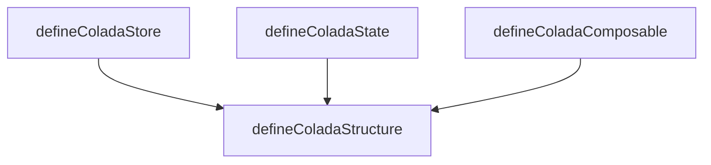

# colada

## Purpose

Package-level vision for colada-store. Single entry for how the pieces fit together. Details live in the linked requirement files; this file does not repeat them.

## Architecture

- **defineColadaStructure** – Core abstraction and mapping layer. Base properties, interface config (rename/disable/wrap), typings. See [define-colada-structure.reqs.md](./define-colada-structure.reqs.md).
- **defineColadaStore** – Store interface (id, deps, constants, state, getters, helpers, actions, hooks). Singleton/global semantics are specific to the store. See [define-colada-store.reqs.md](./define-colada-store.reqs.md).
- **defineColadaState** – State interface (name, state, getters, helpers, actions, hooks). See [define-colada-state.reqs.md](./define-colada-state.reqs.md).
- **defineColadaComposable** – Composable interface with constructor/init-call props. See [define-colada-composable.reqs.md](./define-colada-composable.reqs.md).
